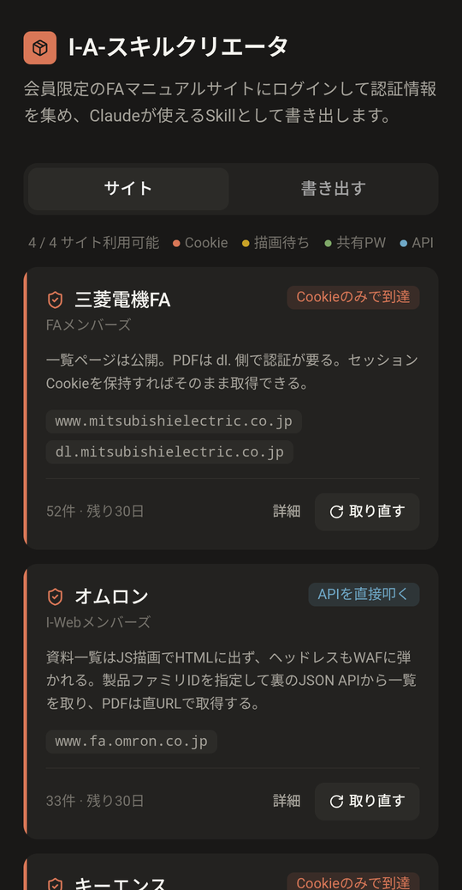
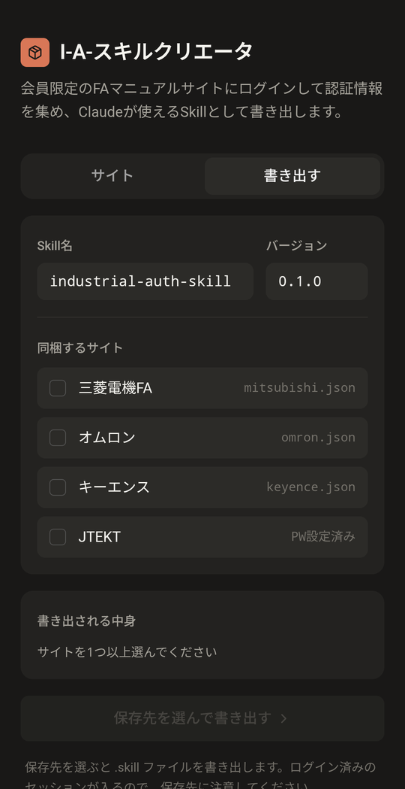

<div align="center">


# I-A-SkillCreator

**An Android app that logs into member-only factory-automation manual sites
and packages the session into a Claude Skill**

[English](README.md) · [日本語](README.ja.md)

[](LICENSE)


</div>

---

Most manuals from Mitsubishi Electric FA, OMRON, KEYENCE and JTEKT sit behind a
member login or a password gate. Ask an AI assistant to look up a PLC
specification and it hits the login wall instead of the document.

This app has you **log in normally in a WebView on your own device**, then packages
the resulting session into a Claude Skill. Load the exported `.skill` into Claude
and it can read those member-only PDFs directly.

<div align="center">

| Sites | Export |
| :---: | :---: |
|  |  |
| Cookie count, days remaining, and a<br>badge for each site's access method | Pick which sites to bundle, choose<br>a location, write the `.skill` |

</div>

## What it does

- Keyword search across each vendor's **entire product range** — not just PLCs, but
  servos, inverters, HMIs, sensors, temperature controllers and more
- Downloads member-only PDFs
- Carries only session cookies; your ID and password are never stored in the app

Products verified working:

| Vendor | Products | Category |
| --- | --- | --- |
| Mitsubishi Electric FA | MR-J5 / FR-A800 / GOT2000 | Servo, inverter, HMI |
| OMRON | Sysmac Studio / NX / E5CC / E3Z | Software, PLC, temperature controller, sensor |
| KEYENCE | KV STUDIO / KV-8000 / IX / IV3 / SR-X | Software, PLC, displacement sensor, vision sensor, code reader |
| JTEKT | TOYOPUC series | PLC, motion |

## Supported sites

| Site | Method | Listing & search | PDF download |
| --- | --- | --- | --- |
| Mitsubishi Electric FA (FA Members) | Cookie | ✅ | ✅ |
| OMRON (I-Web Members) | Cookie + JSON API | ✅ | ✅ |
| KEYENCE | Cookie | ✅ | ✅ |
| JTEKT | Shared password (user-supplied) | ✅ | ✅ |

Each site is built differently, so the Skill carries four retrieval strategies:

- **Mitsubishi** — search results link directly to member-only PDFs
- **OMRON** — the document list is rendered by JavaScript, and a headless browser
  gets blocked by the WAF, so the Skill calls the same JSON API the page itself uses
- **KEYENCE** — document data is embedded in the page; downloads go through a
  three-step confirmation flow
- **JTEKT** — a single shared password unlocks the PDF gate. The password is **not**
  in this repository; you enter it once in the app

## Usage

1. Launch the app and tap **ログイン** (Log in) on a site card
2. Sign in as you normally would in the WebView, then tap **完了** (Done)
3. For JTEKT only, type the shared password into the card and tap **保存** (Save)
4. On the **書き出す** (Export) tab, select sites, pick a location, write the `.skill`
5. Register the exported `.skill` with Claude

> **About the JTEKT shared password**
> JTEKT manuals sit behind a single password gate. Use the password the
> manufacturer provides to its users. It is not included in this repository or in
> the APK, and what you enter is stored only in the app's private storage on your
> device.

Once registered, just ask Claude normally:

```
Check the manual for restrictions on online editing in GX Works3
What is the setting range for parameter Pr.7 on the FR-A800?
```

### Inside the Skill

```
industrial-auth-skill/
├── SKILL.md            # instructions for Claude
├── auth/
│   ├── mitsubishi.json # cookies + User-Agent + capture time
│   ├── omron.json
│   ├── keyence.json
│   └── jtekt.pw.json   # shared password
└── scripts/
    ├── session.py      # session construction, expiry detection
    └── fetch.py        # search, listing, PDF retrieval
```

Main `fetch.py` options:

```bash
# Keyword search across the vendor's whole catalogue
python scripts/fetch.py --site mitsubishi --search "FR-A800"

# Download a PDF
python scripts/fetch.py --site omron --url "<PDF URL>" --out manual.pdf

# List links on a page
python scripts/fetch.py --site jtekt --links '\.pdf$' --url "<URL>"

# OMRON: document list for a product family
python scripts/fetch.py --site omron --family 3077

# KEYENCE: document cards on a support page
python scripts/fetch.py --site keyence --cards --url "<URL>"

# KEYENCE: download a PDF by asset ID
python scripts/fetch.py --site keyence --asset AS_166466 --out kv8000.pdf
```

## Session lifetime

The `expiresAt` field in `auth/*.json` is simply capture time plus 30 days. **Actual
lifetimes vary considerably by site.**

- Mitsubishi and OMRON — days to weeks
- **KEYENCE — around 25 minutes in testing.** Re-capture immediately before exporting

When a KEYENCE session expires you get an **empty list rather than an error**. If a
listing comes back with zero results, suspect an expired session before concluding
the product isn't supported.

If the Skill reports `AUTH_EXPIRED`, re-capture in the app and export again. Claude
will not ask you for your ID or password — SKILL.md explicitly forbids it.

## Building

Requirements: JDK 17+, Node.js 20+, Android SDK (compileSdk 35)

```bash
# 1) Build the web UI into assets
cd web
npm install
npm run build
cp -r dist ../android/app/src/main/assets/www

# 2) Build the APK
cd ../android
./gradlew assembleDebug
```

### Release build

Create `android/keystore.properties` (already gitignored):

```properties
storeFile=/path/to/your.keystore
storePassword=****
keyAlias=****
keyPassword=****
```

```bash
./gradlew assembleRelease
```

Without that file, `assembleRelease` produces an unsigned APK.

## Architecture

A React app running in a WebView, with a thin native layer.

```
web/                       Vite + React + Tailwind + shadcn/ui
android/app/src/main/
├── java/.../
│   ├── MainActivity.java  WebView host + Storage Access Framework
│   ├── AssetServer.java   serves assets over a virtual https origin
│   ├── LoginActivity.java login WebView + cookie capture
│   ├── FaBridge.java      JavascriptInterface
│   ├── AuthStore.java     credential storage (app-private)
│   └── SkillBuilder.java  builds the .skill archive
└── assets/skill/          Skill template and scripts
```

One note on the WebView: the UI is served from
`https://appassets.androidplatform.net/` rather than `file://`. The ES modules Vite
emits are blocked by CORS on the opaque `file://` origin, which leaves the screen
blank.

## Security notes

- An exported `.skill` **contains a live logged-in session**. Be careful where you
  put it
- Credentials live in the app's private storage (SharedPreferences). Your ID and
  password are not stored
- `.gitignore` excludes `*.skill` and `auth/*.json`
- The JTEKT shared password is not in the source. Users enter it in the app and it
  stays on the device

## Disclaimer

Follow each site's terms of service. This app accesses those sites **with the
user's own account**; it is not a means of bypassing authentication.
Redistributing the manuals you retrieve may infringe the manufacturers' rights.

Sites change, and this may stop working when they do.

## License

[MIT](LICENSE)
